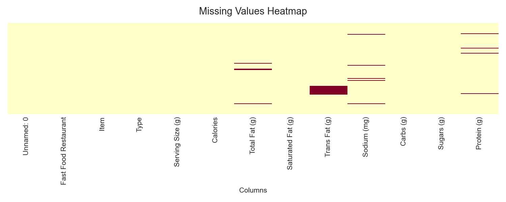
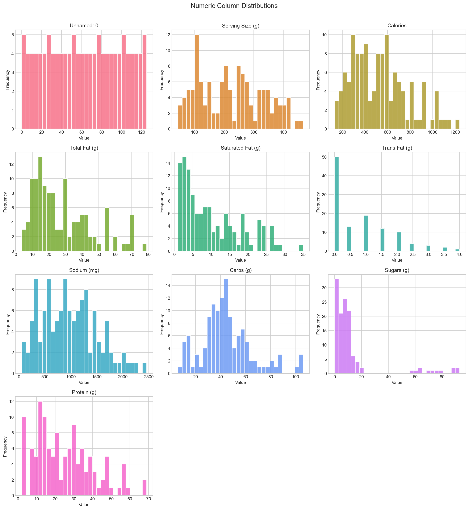
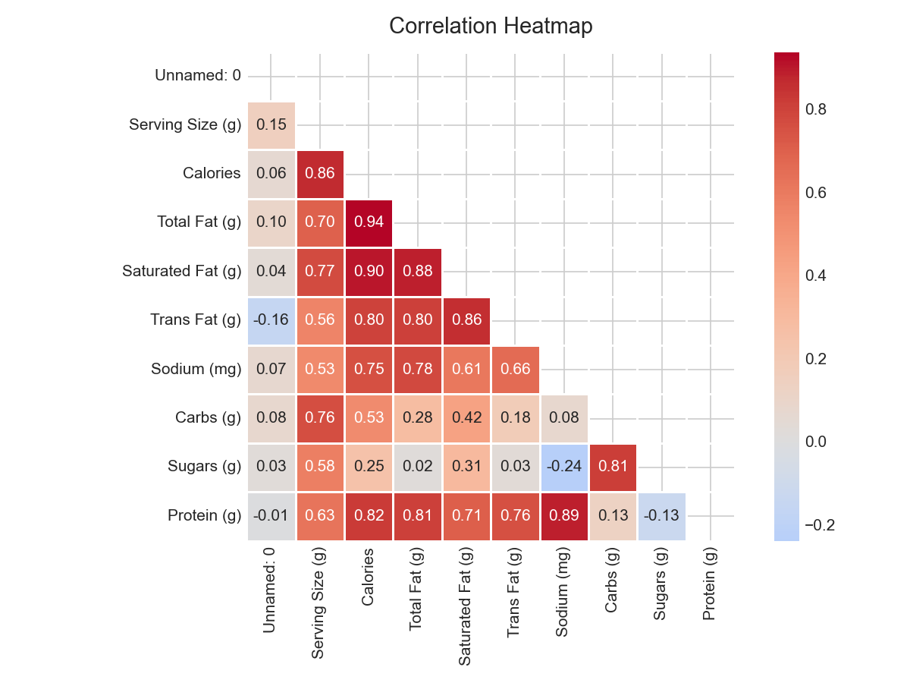
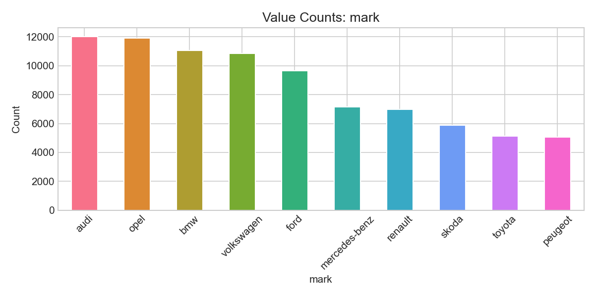
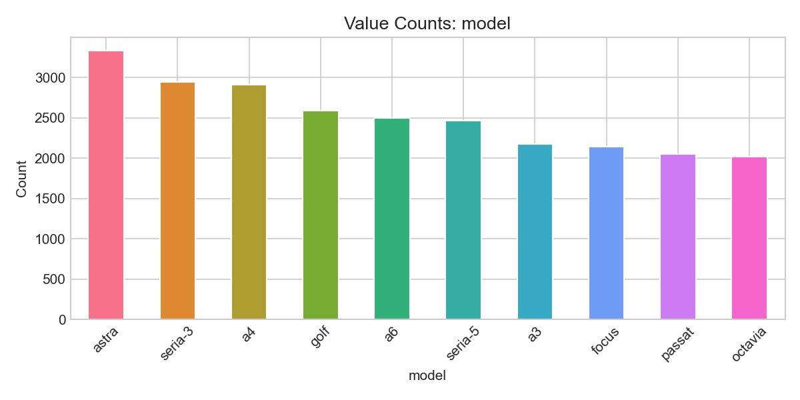
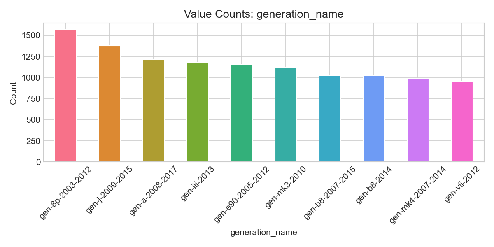

# EDA Report: data/Car_Prices_Poland.csv
*Generated automatically by EDA Agent on March 30, 2026 at 15:21*

---

# Exploratory Data Analysis: Polish Car Prices Dataset

## 1. Dataset Overview

This dataset contains **117,927 car listings** from the Polish automotive market with 11 features covering vehicle specifications, geographic information, and pricing. The data appears to be a comprehensive sample of used car sales, spanning vehicles from 1945 to 2022, though heavily concentrated in more recent years (median year: 2013).

Key features include:
- **Identification**: Index column and car specifications (mark, model, generation_name)
- **Vehicle Characteristics**: year, mileage, vol_engine (engine volume in cc), fuel type
- **Geographic**: city and province of sale
- **Target Variable**: price (in Polish Złoty)

The dataset shows no duplicate rows, indicating good initial data cleaning, but has one significant missing data issue that requires attention.

## 2. Data Quality Assessment

### HIGH PRIORITY Issues:
- **generation_name**: 30,085 missing values (25.51%) - This represents a quarter of all records and will require strategic handling for ML models

### Medium Priority Issues:
- **Outliers detected across multiple numeric variables**:
  - `price`: 2,537 outliers (2.15%) with maximum value of 2,399,900 PLN suggesting luxury/exotic vehicles
  - `vol_engine`: 2,265 outliers (1.92%) with maximum of 7,600cc indicating trucks or specialty vehicles
  - `mileage`: 377 outliers (0.32%) with maximum of 2.8 million km (likely data entry errors)
  - `year`: 283 outliers (0.24%) including vehicles from 1945, which may be classic cars

### Data Integrity:
- Engine volumes of 0cc (minimum value) suggest missing data coded as zero rather than NULL
- Mileage of 0 km may represent new vehicles or data entry issues
- The `Unnamed: 0` column is simply a row index and should be dropped

## 3. Key Statistical Insights

### Price Distribution (Target Variable):
- **Highly right-skewed** (skewness: 3.67) with mean 70,300 PLN significantly higher than median 41,900 PLN
- **Extreme kurtosis** (25.39) indicates heavy tails with many outliers
- This distribution will likely benefit from log transformation for ML modeling

### Vehicle Age Pattern:
- Average vehicle year: 2013, indicating a market dominated by ~10-year-old cars
- Slight negative skewness (-0.53) shows more recent vehicles than older ones
- The 77-year span (1945-2022) includes both modern and vintage vehicles

### Mileage Characteristics:
- Mean mileage of 140,977 km with high standard deviation (92,369 km) 
- Positive skewness (0.62) typical of used car markets where high-mileage outliers exist
- The median (146,269 km) being higher than mean suggests most cars have substantial mileage

### Engine Volume Distribution:
- Average 1,812cc with significant right skew (1.99)
- High kurtosis (8.88) indicates concentration around smaller engines with performance/luxury outliers

## 4. Correlation Analysis

### Strong Correlations:
- **year ↔ mileage**: -0.732 (strong negative) - Newer cars expectedly have lower mileage
- **year ↔ price**: 0.596 (moderate positive) - Newer cars command higher prices
- **mileage ↔ price**: -0.543 (moderate negative) - Higher mileage reduces value

### Model Implications:
- **No multicollinearity concerns** - highest correlation (0.73) is below the 0.7+ threshold requiring attention
- The year-mileage relationship is logical and shouldn't cause modeling issues
- Engine volume shows weak correlations, suggesting it's an independent value driver

## 5. Categorical Variable Analysis

### Brand Distribution:

**Market Leaders**: The top 5 brands represent 55,527 listings (47% of dataset):
- Audi: 12,031 (10.2%)
- Opel: 11,914 (10.1%) 
- BMW: 11,070 (9.4%)
- Volkswagen: 10,848 (9.2%)
- Ford: 9,664 (8.2%)

### Model Complexity:

**High cardinality concern**: 328 unique models with long-tail distribution
- Top model (Astra): only 3,331 occurrences (2.8%)
- This suggests need for model grouping or rare category handling

### Generation Analysis:

**Critical for pricing**: Despite 25.51% missing values, generation_name has 364 unique values
- Top generation: only 1,567 occurrences (1.3% of total data)
- Missing data represents significant information loss for valuation models

### Fuel Type Distribution:
- **Gasoline dominates**: 61,597 vehicles (52.2%)
- **Diesel strong second**: 48,476 vehicles (41.1%)
- **Alternative fuels emerging**: LPG (3.6%), Hybrid (2.2%), Electric (0.8%)

### Geographic Concentration:
- **Mazowieckie province** (Warsaw region): 22,219 listings (18.8%)
- **Urban concentration**: Top 5 cities represent 19,395 listings (16.4%)
- High cardinality in cities (4,427 unique) may require geographic clustering

## 6. ML Readiness Assessment

### Strengths:
- **Large dataset**: 117,927 samples provide excellent training volume
- **No duplicates**: Clean data foundation
- **Balanced target correlations**: Multiple predictive features without multicollinearity
- **Rich categorical features**: Brand, model, and geographic data for segmentation

### Challenges:
- **Target variable skewness**: Price distribution requires transformation (log-normal likely optimal)
- **Missing generation data**: 25.51% missing requires imputation strategy or feature exclusion
- **High cardinality categories**: Model (328 levels) and city (4,427 levels) need dimensionality reduction
- **Outlier management**: 2,537 price outliers need investigation before model training

### Feature Engineering Opportunities:
- **Car age**: Derive from 2024 - year for more intuitive feature
- **Brand tiers**: Group into luxury, mainstream, budget segments
- **Geographic clustering**: Aggregate cities into economic regions
- **Mileage per year**: Calculate annual usage patterns

## 7. Recommended Next Steps

### Immediate Actions (Week 1):
1. **Remove** `Unnamed: 0` index column
2. **Investigate** engine volume = 0 cases - impute or flag as missing
3. **Log-transform** price variable to address skewness
4. **Create** car_age feature from current year - manufacture year

### Data Quality Improvements (Week 2):
1. **Address generation_name** missing values:
   - Option A: Impute using mark + model + year combinations
   - Option B: Create "unknown_generation" category
   - Option C: Drop feature if imputation quality is poor
2. **Outlier treatment**:
   - Cap mileage at 99th percentile (likely data entry errors above)
   - Investigate luxury car pricing outliers - keep if legitimate
   - Review vintage cars (pre-1990) for separate modeling

### Feature Engineering (Week 2-3):
1. **Categorical encoding**:
   - Target encode high-cardinality features (model, city)
   - One-hot encode low-cardinality features (fuel, province)
2. **Geographic features**:
   - Create economic region clusters from provinces
   - Add urban/rural classification based on city size
3. **Brand segmentation**:
   - Create luxury_brand binary feature (BMW, Audi, Mercedes)
   - Group rare brands (< 1000 occurrences) as "other"

### Model Development Strategy (Week 3-4):
1. **Start with robust algorithms**: Random Forest and Gradient Boosting handle skewed data well
2. **Cross-validation approach**: Stratify by brand and price quartiles
3. **Evaluation metrics**: Use RMSE on log-transformed prices, convert back for business interpretation
4. **Baseline comparison**: Simple linear regression on year, mileage, and engine volume

This dataset shows strong potential for accurate price prediction models, with the primary challenges being distribution skewness and missing generation data rather than fundamental data quality issues.