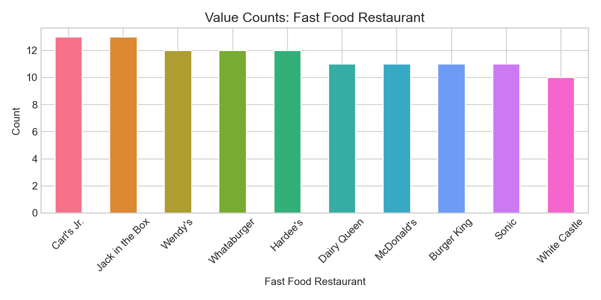
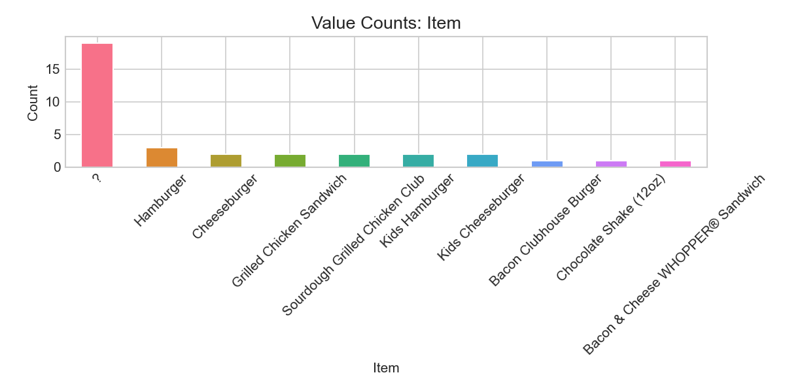
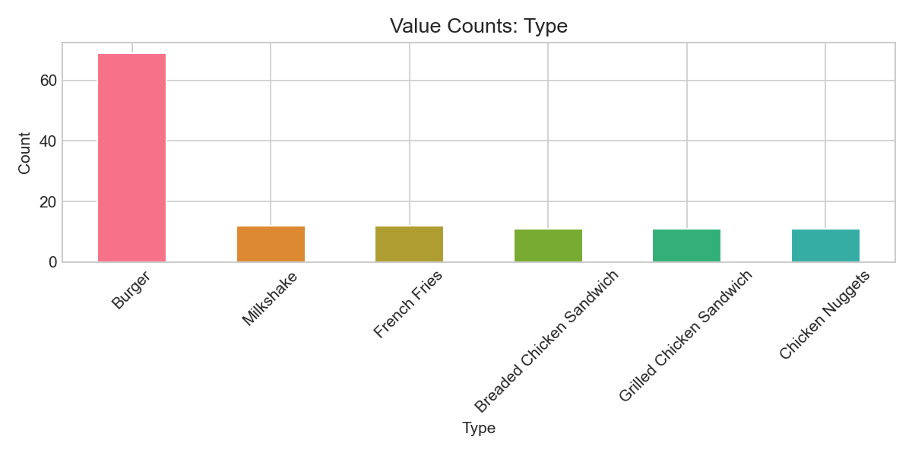

# EDA Report: Nutritional_Data_for_Fast_Foods.csv
*Generated automatically by EDA Agent on March 30, 2026 at 16:08*

---

# Exploratory Data Analysis Report: Fast Food Nutritional Data

## 1. Dataset Overview

This dataset contains nutritional information for 126 fast food menu items across 12 restaurant chains. The data includes comprehensive nutritional metrics such as calories, fats, sodium, carbohydrates, sugars, and protein content, alongside categorical identifiers for restaurant, item name, and food type.

**Key Dataset Characteristics:**
- **Size:** 126 rows × 13 columns
- **Scope:** 12 fast food restaurant chains with 101 unique menu items
- **Coverage:** 6 food categories (Burgers, Milkshakes, French Fries, Chicken Sandwiches, etc.)
- **Nutritional Completeness:** 9 quantitative nutritional metrics per item

The dataset appears well-structured for analyzing nutritional patterns across fast food chains and food categories, with sufficient sample size for meaningful statistical analysis.

## 2. Data Quality Assessment

**HIGH PRIORITY Issue:** Trans Fat (g) has 9.52% missing values (12 out of 126 records), which exceeds our 5% threshold and requires immediate attention.

**Missing Value Summary:**
| Column | Missing Count | Percentage | Priority |
|--------|---------------|------------|----------|
| Trans Fat (g) | 12 | 9.52% | HIGH |
| Sodium (mg) | 5 | 3.97% | Medium |
| Total Fat (g) | 4 | 3.17% | Medium |
| Protein (g) | 4 | 3.17% | Medium |

**Data Quality Issues Identified:**
1. **Item Name Quality Problem:** 19 items are labeled as "?" indicating incomplete data collection
2. **No Duplicate Records:** Clean dataset with 0 duplicate rows
3. **Data Type Consistency:** Appropriate numeric/categorical typing across all columns
4. **Index Column:** "Unnamed: 0" is a redundant row index that should be dropped

The Trans Fat missing values likely reflect regulatory changes where restaurants stopped reporting trans fat content, requiring domain-specific imputation strategies.

## 3. Key Statistical Insights

**Caloric Distribution Analysis:**
- **Mean:** 532 calories with high variability (SD: 251)
- **Range:** 130-1,240 calories (nearly 10x difference)
- **Distribution:** Right-skewed (0.65) indicating many high-calorie outliers

**Notable Nutritional Patterns:**
- **Sodium Levels:** Average 976mg per item (range: 50-2,460mg) - many items exceed daily recommended limits
- **Sugar Content:** Highly variable with extreme right skew (2.71) - 6 statistical outliers detected with max of 93g
- **Protein Range:** 2-69g with reasonable distribution, suggesting diverse food categories

**Serving Size Insights:**
- **Average:** 224g with moderate variability
- **Distribution:** Nearly normal (skewness: 0.24) indicating consistent portion sizing across chains

## 4. Correlation Analysis

**CRITICAL MULTICOLLINEARITY WARNINGS:**
Several correlation pairs exceed 0.7, indicating potential redundancy for ML models:

| Variable Pair | Correlation | Implication |
|---------------|-------------|-------------|
| Calories ↔ Total Fat | 0.94 | Near-perfect correlation |
| Calories ↔ Saturated Fat | 0.90 | Very strong relationship |
| Sodium ↔ Protein | 0.89 | Unexpected strong link |
| Total Fat ↔ Saturated Fat | 0.88 | Expected nutritional relationship |
| Serving Size ↔ Calories | 0.86 | Logical portion-calorie link |

**Key Insights:**
1. **Fat-Calorie Dominance:** Total fat is the primary driver of caloric content (r=0.94)
2. **Sodium-Protein Link:** High correlation (0.89) suggests protein-rich items are heavily salted
3. **Sugar Independence:** Sugars show weaker correlations, indicating beverage/dessert items create distinct nutritional profiles

## 5. Categorical Variable Analysis

**Restaurant Coverage:**
Relatively balanced representation across 12 chains (10-13 items each), with Carl's Jr. and Jack in the Box having slight over-representation (13 items each).

**Food Type Distribution:**
- **Burgers dominate:** 69 items (55% of dataset)
- **Balanced secondary categories:** Milkshakes, French Fries, and Chicken Sandwiches each contribute 11-12 items
- **Good category diversity:** 6 distinct food types enable cross-category analysis

**Item Name Issues:**
- **High cardinality:** 101 unique items across 126 records indicates good menu diversity
- **Data quality concern:** 19 items labeled as "?" require investigation or removal

## 6. ML Readiness Assessment

**Readiness Score: 7/10**

**Strengths:**
- Clean numeric data with appropriate distributions for regression tasks
- Balanced categorical features suitable for classification
- Strong feature relationships identified for feature engineering
- No duplicate records

**Critical Issues for ML:**
1. **Missing Value Strategy:** Trans Fat (9.52% missing) requires domain-specific imputation
2. **Multicollinearity Risk:** Multiple correlation pairs >0.9 will cause model instability
3. **Feature Engineering Needed:** High correlations suggest potential for dimensionality reduction
4. **Data Cleaning:** 19 "?" item names need resolution

**Recommended Model Approaches:**
- **For Calorie Prediction:** Ridge/Lasso regression to handle multicollinearity
- **For Food Classification:** Random Forest or SVM with categorical encoding
- **Avoid:** Linear regression without regularization due to correlation issues

## 7. Recommended Next Steps

**Immediate Actions (Week 1):**
1. **Investigate Trans Fat Missing Values:** Determine if missing values represent true zeros or missing measurements
2. **Resolve Item Name Issues:** Contact data source to clarify the 19 items labeled as "?"
3. **Remove Redundant Column:** Drop "Unnamed: 0" index column

**Data Preprocessing (Week 2):**
1. **Implement Missing Value Strategy:** 
   - Trans Fat: Domain-specific imputation (likely zeros for post-2015 data)
   - Other nutrients: KNN imputation based on food type and restaurant
2. **Address Multicollinearity:**
   - Create fat ratio features (Saturated/Total Fat)
   - Consider PCA for highly correlated nutritional variables
3. **Feature Engineering:**
   - Calculate calories-per-gram ratios
   - Create nutritional density scores
   - Encode categorical variables appropriately

**Model Development (Week 3-4):**
1. **Baseline Models:** Start with regularized regression for calorie prediction
2. **Cross-Validation:** Use restaurant-based splits to avoid data leakage
3. **Feature Selection:** Use LASSO coefficients to identify most predictive nutrients
4. **Model Validation:** Compare predictions against FDA nutritional guidelines for sanity checks

**Business Applications:**
- **Menu Optimization:** Identify nutritional improvement opportunities
- **Competitive Analysis:** Benchmark nutritional profiles across chains
- **Health Scoring:** Develop standardized nutritional rating system